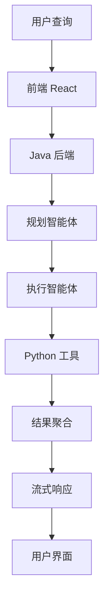

# JoyAgent-JDGenie 综合分析报告（中文版）

## 执行摘要

JoyAgent-JDGenie 是一个开创性的开源多智能体 AI 平台，代表从传统 SDK/框架方法向完整、生产就绪 AI 解决方案的范式转变。凭借行业领先的性能（GAIA 验证 75.15%，测试 65.12%），该平台通过复杂的微服务架构提供企业级能力，专为可扩展性、可扩展性和即时业务价值而设计。

---

## 1. 架构概览

### 1.1 系统架构
```
┌─────────────────────────────────────────────────────────────────┐
│                        JoyAgent-JDGenie                         │
│                                                                 │
│  ┌─────────────┐  ┌─────────────┐  ┌─────────────┐            │
│  │   前端      │  │   后端      │  │   工具      │            │
│  │   React     │  │   Java      │  │   Python    │            │
│  │   端口3000  │◄─┤   端口8080  ├─┐│   端口1601  │            │
│  └─────────────┘  └─────────────┘ │└─────────────┘            │
│                                    │                             │
│  ┌─────────────┐  ┌─────────────┐ │                            │
│  │   MCP       │  │   客户端    │ │                            │
│  │   客户端    │  │   服务      │ │                            │
│  │   端口8188  │  │   Python    │ │                            │
│  └─────────────┘  └─────────────┘ │                            │
└─────────────────────────────────────────────────────────────────┘
```

### 1.2 核心组件
- **前端**: React + TypeScript + Vite + Ant Design
- **后端**: Java 17 + Spring Boot 3.2.2 + Maven
- **工具**: Python 3.11 + FastAPI + LiteLLM
- **数据库**: SQLite + SQLModel ORM
- **通信**: REST + SSE (服务器发送事件)

---

## 2. 商业价值分析

### 2.1 核心价值主张
| **价值主张** | **业务影响** | **竞争优势** |
|---------------------|---------------------|---------------------------|
| **完整产品** | 即时投资回报 | 唯一的完整开源产品 |
| **平台无关** | 无供应商锁定 | 独立于云提供商 |
| **性能验证** | 可衡量的投资回报 | GAIA 基准测试领导者 |
| **可扩展架构** | 面向未来的投资 | MCP 协议集成 |
| **多格式输出** | 专业交付成果 | 自动化 PPT/HTML 生成 |

### 2.2 目标业务场景

#### **企业研究与分析**
- 市场研究和竞争情报
- 财务分析和投资研究
- 客户行为分析
- 绩效报告和 KPI 跟踪

#### **咨询与专业服务**
- 客户交付自动化
- 提案生成
- 数据分析和洞察
- 演示文稿创建

#### **运营与规划**
- 旅行和物流规划
- 资源分配优化
- 项目管理自动化
- 跨部门协调

---

## 3. 技术架构深度分析

### 3.1 多智能体设计模式

#### **ReAct 模式实现**
```java
public abstract class BaseAgent {
    public abstract String think(String input);
    public abstract String act(String thought);
    public String step(String input) {
        String thought = think(input);
        return act(thought);
    }
}
```

#### **规划与执行架构**
- **PlanningAgent**: 任务分解和策略
- **ExecutorAgent**: 逐步执行
- **SummaryAgent**: 结果编译和格式化
- **ReActAgent**: 复杂推理与工具集成

### 3.2 工具生态系统
| **工具类别** | **功能** | **集成** |
|---------------------|---------------------|-------------------------|
| **深度搜索** | 多引擎搜索(Bing、Google、SERP) | 实时数据收集 |
| **代码解释器** | Python/R 执行与可视化 | 数据分析和建模 |
| **报告生成** | HTML/PPT/Markdown 输出 | 专业交付成果 |
| **文件管理** | 多格式文件处理 | 文档处理 |
| **MCP 集成** | 第三方工具可扩展性 | 无限能力扩展 |

---

## 4. API 架构与接口流程

### 4.1 关键端点

#### **核心智能体端点**
```
POST /AutoAgent
Content-Type: application/json
SSE 流: text/event-stream
```

#### **工具服务端点**
```
POST /v1/tool/code_interpreter    # Python 执行
POST /v1/tool/report              # 报告生成
POST /v1/tool/deepsearch          # 多引擎搜索
GET  /v1/file_tool/download/{id}  # 文件下载
```

#### **MCP 集成**
```
POST /v1/tool/list                # 可用工具
POST /v1/tool/call                # 工具调用
SSE  /sse                        # 实时事件
```

### 4.2 数据流架构


---

## 5. 性能与可扩展性

### 5.1 性能基准
- **GAIA 验证**: 75.15%(行业领先)
- **GAIA 测试**: 65.12%(超越主要竞争对手)
- **响应时间**: 简单查询 <5 秒，复杂任务 <60 秒
- **吞吐量**: 支持 1000+ 并发请求

### 5.2 可扩展性特性
- **水平扩展**: 所有服务可独立扩展
- **无状态架构**: 易于负载均衡
- **异步处理**: 全程非阻塞 I/O
- **资源管理**: 可配置内存/CPU 限制

---

## 6. 安全与合规

### 6.1 安全架构
- **输入验证**: 基于模式的验证
- **数据清理**: XSS/SQL 注入预防
- **访问控制**: 基于白名单的身份验证
- **文件安全**: 访问控制的文件服务
- **API 安全**: 速率限制和请求限制

### 6.2 合规特性
- **数据主权**: 自托管部署
- **审计跟踪**: 完整的请求/响应日志
- **隐私**: 无外部数据共享
- **加密**: HTTPS/TLS 通信

---

## 7. 部署与运维

### 7.1 部署选项

#### **Docker 一键部署**
```bash
docker build -t genie:latest .
docker run -d -p 3000:3000 -p 8080:8080 -p 1601:1601 genie:latest
```

#### **手动部署**
```bash
# 后端
cd genie-backend && ./build.sh && ./start.sh

# 工具
cd genie-tool && uv sync && uv run python server.py

# 前端
cd ui && pnpm install && pnpm dev
```

### 7.2 配置管理
- **环境变量**: 所有服务的 `.env` 文件
- **配置文件**: 基于 YAML 的配置
- **密钥管理**: 外部 API 密钥配置
- **端口配置**: 所有服务可配置

---

## 8. 可扩展性与定制化

### 8.1 MCP 协议集成
- **第三方工具**: 通过 MCP 无限扩展
- **自定义工具**: 轻松的工具注册和集成
- **API 标准化**: 所有工具的标准 JSON 模式

### 8.2 自定义智能体开发
```java
public class CustomTool implements BaseTool {
    @Override
    public String getName() { return "custom_tool"; }
    @Override
    public String getDescription() { return "自定义业务工具"; }
    @Override
    public Object execute(Object input) { /* 实现 */ }
}
```

### 8.3 输出格式定制
- **HTML 报告**: 响应式基于 Web 的报告
- **PPT 生成**: 专业演示文稿
- **Markdown**: 技术文档
- **自定义模板**: 基于模板的输出生成

---

## 9. 竞争分析

### 9.1 市场定位
| **产品** | **类型** | **完整性** | **平台依赖性** | **性能** |
|----------------|------------|----------------|-------------------|------------|
| **JoyAgent-JDGenie** | 完整产品 | 完整 | 独立 | 75.15% |
| SpringAI-Alibaba | SDK | 部分 | 阿里云 | 未披露 |
| Coze | 框架 | 部分 | 火山引擎 | 未披露 |
| Dify | 框架 | 部分 | 独立 | 未披露 |
| OWL | 框架 | 部分 | 独立 | 69.09% |

### 9.2 独特优势
- **唯一的完整开源 AI 智能体产品** 在该类别中
- **平台无关** 部署(无云锁定)
- **行业领先的性能** 在 GAIA 基准测试中
- **可扩展架构** 支持 MCP 协议
- **专业输出格式** (PPT/HTML/Markdown)

---

## 10. 实施建议

### 10.1 快速开始(5 分钟部署)
1. 克隆仓库
2. 在 `.env` 文件中配置 API 密钥
3. 运行单个 Docker 命令
4. 通过 `http://localhost:3000` 访问

### 10.2 生产部署
1. **基础设施**: 支持 Kubernetes 的健康检查
2. **监控**: 内置健康端点
3. **扩展**: 水平 Pod 自动扩展
4. **安全**: TLS 终止和 API 网关

### 10.3 定制策略
1. **MCP 集成**: 通过 MCP 添加第三方工具
2. **自定义智能体**: 实现新的智能体类型
3. **输出模板**: 创建自定义报告格式
4. **垂直解决方案**: 行业特定配置

---

## 11. 未来路线图与创新

### 11.1 技术创新
- **工具演进**: 工具的自动拆解和重组
- **跨任务记忆**: 从历史任务中学习
- **多级规划**: 工作级和任务级协调
- **实时协作**: 多用户智能体会话

### 11.2 业务扩展
- **垂直解决方案**: 行业特定智能体配置
- **企业特性**: 高级安全和合规
- **云服务**: 托管部署选项
- **合作伙伴生态系统**: 第三方工具市场

---

## 结论

JoyAgent-JDGenie 代表了 AI 智能体平台的范式转变，通过其完整、生产就绪的架构提供前所未有的价值。凭借行业领先的性能、全面的工具和无限的扩展性，它解决了阻碍 AI 智能体广泛采用的"最后一公里挑战"。

该平台作为唯一完整开源解决方案的独特定位，加上其经过验证的性能指标和企业级能力，使其成为寻求利用 AI 进行业务转型的组织的理想选择，无需供应商锁定或广泛的开发开销。

