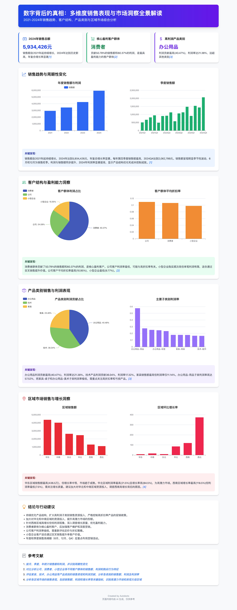

# DataAgent开源git开源文档

## 简介
当前Data Agent相关竞品，有些不支持数据治理、有些不支持诊断分析、有些不开源。因此，我们从端到端开箱即用的角度，我们开源了JoyDataAgent其包含了数据治理DGP协议&工具、智能问数、诊断分析和工作建议。特别对于诊断分析和工作建议，这类问题往往没有固定答案也无法通过例行报告自动呈现，正需要JoyDataAgent提供的“新角度”与aha moment来激发思考。
对于JoyDataAgent是一个通用的智能问数的框架和产品，对于用户的场景，只需将表按照DGP协议进行治理后，即可直接进行问数和诊断分析。为了验证JoyDataAgent的通用性，在Birdsql公开榜单test集准确率75.35%排名第7（共84支提交队伍），目前得分领先于字节跳动DataAgent、IBM等竞争对手。
### 竞品功能分析


## 案例展示
<table>
<tbody>
<tr>
<td></td>
<td style="width: 45.8%"></td>
</tr>
</tbody>
</table>


<table>
<tbody>
<tr>
<td>

<video src="https://github.com/user-attachments/assets/5fd93580-454c-4ab8-b739-54f5b8a3b447" data-canonical-src="https://private-user-images.githubusercontent.com/49786633/469170308-065b8d1a-92e4-470a-bbe3-426fafeca5c4.mp4?jwt=eyJhbGciOiJIUzI1NiIsInR5cCI6IkpXVCJ9.eyJpc3MiOiJnaXRodWIuY29tIiwiYXVkIjoicmF3LmdpdGh1YnVzZXJjb250ZW50LmNvbSIsImtleSI6ImtleTUiLCJleHAiOjE3NTMxOTEzNzEsIm5iZiI6MTc1MzE5MTA3MSwicGF0aCI6Ii80OTc4NjYzMy80NjkxNzAzMDgtMDY1YjhkMWEtOTJlNC00NzBhLWJiZTMtNDI2ZmFmZWNhNWM0Lm1wND9YLUFtei1BbGdvcml0aG09QVdTNC1ITUFDLVNIQTI1NiZYLUFtei1DcmVkZW50aWFsPUFLSUFWQ09EWUxTQTUzUFFLNFpBJTJGMjAyNTA3MjIlMkZ1cy1lYXN0LTElMkZzMyUyRmF3czRfcmVxdWVzdCZYLUFtei1EYXRlPTIwMjUwNzIyVDEzMzExMVomWC1BbXotRXhwaXJlcz0zMDAmWC1BbXotU2lnbmF0dXJlPWRjNGY5ZTlmMTA4ODVhMWE0ZmEzYzU3YTIwYzJkYmIyY2Y0ZWE0NGUwZWU2ODAxNDA2MzQ0NzMyMWFlNTdiNWImWC1BbXotU2lnbmVkSGVhZGVycz1ob3N0In0.fJyoUGcWjPWyG64ZwIcWWKz3FrBWuXAHHfdTLpIaaeU" controls="controls" muted="muted" class="d-block rounded-bottom-2 border-top width-fit" style="max-height:640px; min-height: 200px">
</video>

<td>

<video src="https://github.com/user-attachments/assets/d36dc9df-eeab-4b34-a2ed-0c46ba60c353" data-canonical-src="https://private-user-images.githubusercontent.com/49786633/469171050-15dcf089-5659-489e-849d-39c651ca7e5a.mp4?jwt=eyJhbGciOiJIUzI1NiIsInR5cCI6IkpXVCJ9.eyJpc3MiOiJnaXRodWIuY29tIiwiYXVkIjoicmF3LmdpdGh1YnVzZXJjb250ZW50LmNvbSIsImtleSI6ImtleTUiLCJleHAiOjE3NTMxOTEzNzEsIm5iZiI6MTc1MzE5MTA3MSwicGF0aCI6Ii80OTc4NjYzMy80NjkxNzEwNTAtMTVkY2YwODktNTY1OS00ODllLTg0OWQtMzljNjUxY2E3ZTVhLm1wND9YLUFtei1BbGdvcml0aG09QVdTNC1ITUFDLVNIQTI1NiZYLUFtei1DcmVkZW50aWFsPUFLSUFWQ09EWUxTQTUzUFFLNFpBJTJGMjAyNTA3MjIlMkZ1cy1lYXN0LTElMkZzMyUyRmF3czRfcmVxdWVzdCZYLUFtei1EYXRlPTIwMjUwNzIyVDEzMzExMVomWC1BbXotRXhwaXJlcz0zMDAmWC1BbXotU2lnbmF0dXJlPTY5ZGU2MWU3NzA5NjYxM2ZhZDYxYTZjMWQxYWMzNGM2MTY2ODkzMTIzYjQ1NzRiOGZkOWUyODYzNmQ4N2Y5ZTUmWC1BbXotU2lnbmVkSGVhZGVycz1ob3N0In0.7KW-JGmFACnf5IS3kL7M0eV8uZhlxDD8Br61XvcgmjY" controls="controls" muted="muted" class="d-block rounded-bottom-2 border-top width-fit" style="max-height:640px; min-height: 200px">
</video>

</td>
</tr>
</tbody>
</table>

## 效果先进性：Birdsql榜单

### Test集效果 75.35%, Dev集效果73.66%


## 系统架构


本开源项目基于JoyAgent-JDGenie产品开源了整体的产品界面、智能体的多种核心模式（react模式、plan and executor模式等）、
多个子智能体（report agent、search agent等）以及多智能体间交互协议。同时在此基础上进一步开源了数据分析智能体，主要包括数据治理DGP协议&工具、智能问数、诊断分析和工作建议。

### DGP协议
- **数据治理与挖掘（已完成）**
  - 表设计、字段设计、字段值设计5原则，提供相关的SDK以确保数据的准确、唯一、完整、一致、有效。
  - 表设计原则：明细表和指标表不要混合、增量表和全量表不要混合。
  - 字段设计原则：字段避免混淆、时点指标和时期指标语义要说明。
  - 字段值设计原则：枚举值语义说明。
  
- **数据血缘治理（进行中）**
  - 采集数仓脚本进行SQLAST解析识别出字段、表、加工算子的血缘关系来构建图谱。 
  - 结合上语义上的补充构成丰富的知识图谱，以供RAG召回使用。
  
- **语义对齐和指标数据预编织（进行中）**
  - 语义上的归一对于数据质量很重要，语义构建需要分类，维度含义的统一，以及解决多处定义的冲突。
  - 基于高质量语义与图谱知识的结合，从指标算子口径和语义口径上进行表要的模型预编织，用于在指标数据召回阶段精准约束SQL。

### TableRAG和智能问数
- **TableRAG：两阶段动态选表选字段。**
- **TableRAG：细粒度查询拆解，将复杂问题拆解为更小、更容易处理的语义单元，实现对表格行列值高效检索召回。**
- **智能问数：自适应支持不同类型表的问数能力，明细表VS指标表，增量表VS全量表等。**
- **智能问数：具备智能问数能力并结合图表的可视化展示。**

### 诊断分析
- **多种归因分析工具：包括趋势、周期、异常、相关性、因果等归因方法。**
- **SOPPlan：除了通用的诊断分析功能，此外还支持用户预定义分析流程。基于用户预定义分析流程，升级Plan&Solve模式为SOPPlan模式。**
- **特别对于诊断分析和工作建议，这类问题往往没有固定答案也无法通过例行报告自动呈现，正需要JoyDataAgent提供的“新角度”与aha moment来激发思考。**
## 相关配置
具体见JoyAgent首页的配置说明


## 项目共建者
贡献者：Liu Shangkun,[Li Yang](https://scholar.google.com.hk/citations?hl=zh-CN&user=AeCTbv8AAAAJ&view_op=list_works&gmla=AH8HC4zYqeayQxrQFmScZ7XYxLah1enc8ynhQYMtBdPmjwfpMBvsTj_OoBkFTPCw1Xi2xk7gbTzHPH-QpJSw_sGkCKdYDVXSu8Ty2tNJMhs),Jia Shilin,Tian Shaohua,Wang Zhen,Yao Ting,Wang Hongtao,Zhou Xiaoqing,Liu min,Zhang Shuang,Liuwen,Yangdong,Xu Jialei,Zhou Meilei,Zhao Tingchong,Wu jiaxing, Wang Hanmin, Zhou Zhiyuan, Xu Shiyue,Liu Jiarun

所属机构:京东CHO企业信息化团队（EI）

## 贡献和合作

我们欢迎所有好想法和建议，如果您想成为项目的共建者，可随时向我们提Pull Request。无论是完善产品和框架、修复bug还是添加新特性，您的贡献都非常宝贵。
在此之前需要您阅读并签署贡献者协议并发送到邮箱org.developer3@jd.com，请阅读 [贡献指南中文版](https://github.com/jd-opensource/joyagent-jdgenie/blob/main/contributor_ZH.pdf)，[贡献指南英文版](https://github.com/jd-opensource/joyagent-jdgenie/blob/main/contributor_EN.pdf)


## 引用

如需学术引用，请使用以下 BibTeX：
```bibtex
@software{JoyAgent-JDGenie,
  author = {Agent Team at JDCHO},
  title = {JoyAgent-JDGenie},
  year = {2025},
  url = {https://github.com/jd-opensource/joyagent-jdgenie},
  version = {0.1.0},
  publisher = {GitHub},
  email = {jiashilin1@jd.com;liyang.1236@jd.com;liushangkun@jd.com;tianshaohua.1@jd.com;wangzhen449@jd.com;yaoting.2@jd.com;houkang6@jd.com;jinglingtuan@jd.com;guohongliang@jd.com}
}
```

## Contributors

<a href="https://github.com/jd-opensource/joyagent-jdgenie/graphs/contributors">
  
</a>

# Star History
[](https://star-history.com/#jd-opensource/joyagent-jdgenie&Date)

欢迎沟通和联系我们  


[//]: # (![contact]&#40;./docs/img/contact.jpg&#41;)
